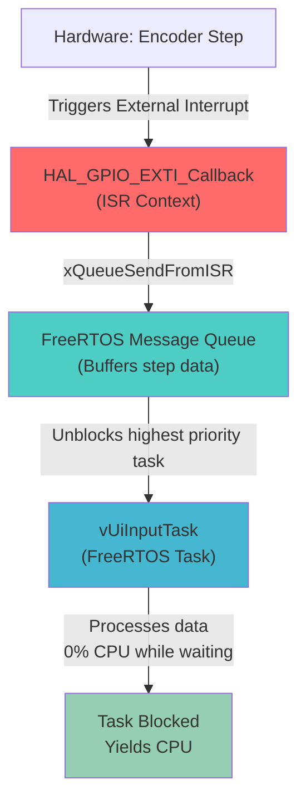

Hier ist der komplette Ablauf sauber zusammengefasst in einem einzigen Markdown-Codeblock. Du kannst diesen Inhalt direkt kopieren und in deine separate README-Datei für den Task einfügen.

# 🔄 UI-Input Task & ISR Synchronization Workflow
This document explains the real-time synchronization between the hardware Interrupt Service Routine (ISR) and the FreeRTOS UI-Input Task using the **Deferred Interrupt Processing** pattern.




---

## 🛠️ Implementation Example

### 1. The Interrupt Service Routine (ISR Context)
Located in your GPIO interrupt management file (e.g., `stm32f4xx_it.c` or a dedicated encoder driver).

```c
#include "FreeRTOS.h"
#include "queue.h"
#include "main.h" // For GPIO Pin definitions

/* Global or extern handle for the communication queue */
extern QueueHandle_t encoderQueueHandle;

/**
 * @brief  EXTI line detection callback.
 *         Triggered by hardware on Rising/Falling edges of Encoder Pins.
 * @param  GPIO_Pin: Specifies the pin connected to EXTI line
 * @retval None
 */
void HAL_GPIO_EXTI_Callback(uint16_t GPIO_Pin)
{
    /* Check if the interrupt came from Encoder Channel A */
    if (GPIO_Pin == ENCODER_PIN_A_Pin) 
    {
        int encoderStep = 0;

        /* Read Channel B to determine the direction of rotation */
        if (HAL_GPIO_ReadPin(ENCODER_PIN_B_GPIO_Port, ENCODER_PIN_B_Pin) == GPIO_PIN_RESET) 
        {
            encoderStep = 1;  /* Clockwise (CW) */
        } 
        else 
        {
            encoderStep = -1; /* Counter-Clockwise (CCW) */
        }

        /* Track if a context switch is required upon exiting the ISR */
        BaseType_t xHigherPriorityTaskWoken = pdFALSE;

        /* Push the calculated step into the queue safely from ISR context */
        xQueueSendFromISR(encoderQueueHandle, &encoderStep, &xHigherPriorityTaskWoken);

        /* Yield the processor if the UI Task has higher priority than the interrupted task */
        portYIELD_FROM_ISR(xHigherPriorityTaskWoken);
    }
}
```

### 2. The UI-Input Task Wrapper (OS Context)
Located inside your `freertos.c` or specialized task runner file.

```c
#include "FreeRTOS.h"
#include "task.h"
#include "queue.h"
#include "ui_control.h" // Your pure business logic module

/* Global handle for the communication queue */
QueueHandle_t encoderQueueHandle = NULL;

/**
 * @brief  UI-Input Task Function.
 *         Highest priority task. Manages user inputs with near-zero latency.
 * @param  argument: Not used
 * @retval None (Must never return!)
 */
void vUiInputTask(void *argument)
{
    /* Initialize the queue with space for 10 entries of 'int' size */
    encoderQueueHandle = xQueueCreate(10, sizeof(int));
    
    /* Initialize pure hardware/software logic of the module */
    UI_Init();

    int receivedStep = 0;

    /* Infinite Task Loop */
    for(;;)
    {
        /* 
         * Execution stops here (Blocked State). The task sleeps and yields 
         * 100% CPU time to lower priority tasks until a message arrives.
         */
        if (xQueueReceive(encoderQueueHandle, &receivedStep, portMAX_DELAY) == pdPASS)
        {
            /* --- Task Module Business Logic --- */
            /* Pass the raw step to the UI controller logic module */
            UI_UpdateEncoderPosition(receivedStep);
            
            /* Check if a button press event needs processing */
            if (UI_CheckButtonState()) 
            {
                // Handle menu navigation or step size multiplier change
            }
            
            /* Optional: Forward new state to Control/SPI Task via another Queue/Notification */
        }
    }
}
```

---

## 🔑 Crucial Architectural Rules

1. **Never block inside the ISR:** Only use non-blocking FreeRTOS API calls ending with `...FromISR`. Never use `vTaskDelay()` or `xQueueReceive()` inside the callback.
2. **Use `portYIELD_FROM_ISR()`:** This enforces immediate execution of your high-priority UI task after the hardware interrupt finishes, eliminating any lag or frame drops.
3. **Queue Sizing:** A depth of `10` is usually plenty for user rotations. If the queue fills up because the Control Task is busy, further ISR steps will be discarded safely without crashing the system.

Wenn du möchtest, können wir als Nächstes die Control/SPI Task strukturieren oder uns anschauen, wie du die DDS-Schrittweite berechnest, die dann per SPI an deinen FPGA geschickt wird. Was steht bei dir als Nächstes an?

