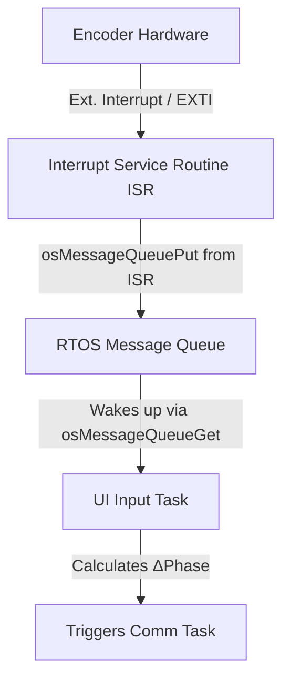
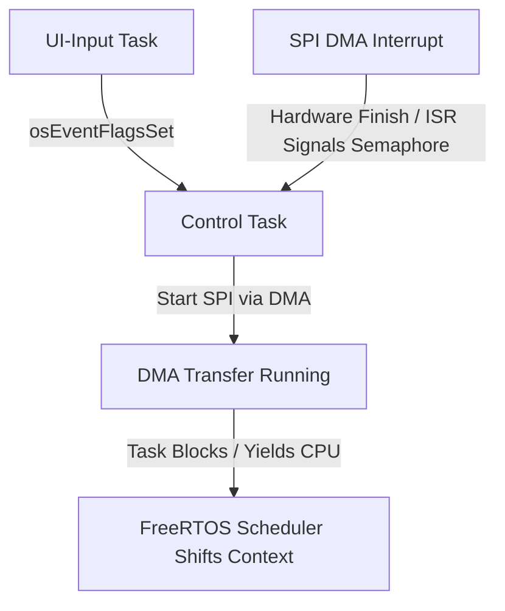
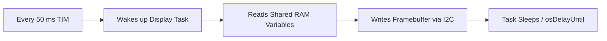

# WaveGenerator
This is a little hobby project to gain some knowledge in creating a small system with a microcontroller and an FPGA, and to learn how they can cooperate. The focus is on learning VHDL.

# 🔗 STM32-FPGA Hybrid Signal Generator

This project is a hybrid function generator. A **STM32 Nucleo** (C/C++) acts as the user interface and controller, while an **FPGA** (VHDL) implements a high-precision DDS core (Direct Digital Synthesis) to generate waveforms in real time.

## 🚀 Overview

Unlike purely software-based solutions, FPGA hardware enables signal generation with extremely low jitter and high frequency stability because the logic operates in parallel and is clock-accurate.

## Software and System Architecture

1. **STM32 (Control Plane):** Manages the user interface (rotary encoder, display) and calculates the increment values for the target frequency.
2. **SPI Bus:** The bridge between the two worlds. The STM32 configures the FPGA like a custom chip.
3. **FPGA (Data Plane):** Contains an SPI slave, a phase accumulator, and a sine LUT (Look-Up Table).
4. **R2R DAC:** A discrete resistor network that converts the 8-bit digital values into an analog voltage.

---

## 🧠 Software Architecture (FreeRTOS)

The STM32 system runs on **FreeRTOS** to provide modular, event-driven, and real-time-capable control. The tasks are strictly separated according to their urgency and priority.

### Task Specification

#### 1. UI Input Task (Highest Priority)
* **Objective:** Processes user inputs from the rotary encoder without missing any steps.
* **Synchronization:** Remains suspended until it receives data via a **FreeRTOS queue** from the hardware ISR (external interrupt) of the encoder.
* **Behavior:** When it wakes up, it immediately calculates the new $\Delta Phase$ value and triggers the control task.

#### 2. Control and Communication Task (Medium Priority)
* **Objective:** Transmits the calculated frequency parameters to the FPGA.
* **Synchronization:** Triggered via a **FreeRTOS Event Flag (Event Group)** by the UI-Input Task upon any parameter change.
* **Efficiency:** Uses **SPI via DMA**. The task blocks itself during the hardware transmission, freeing CPU time until the DMA transfer-complete interrupt wakes it again.

#### 3. Display and Menu Task (Low Priority)
* **Objective:** Updates the menu structure and renders the OLED screen via I2C.
* **Behavior:** Periodic task (`osDelay` of about 50 ms / 20 Hz). Since I2C transfers are slow, this task decouples the sluggish display hardware entirely from the fast UI inputs.

#### 4. Default / Idle Task (Lowest Priority)
* **Objective:** System monitoring, flashing the status LED ("heartbeat"), and optional runtime statistics output via UART.

# 🔍 Deep Dive: Task Implementation and Under-the-Hood Mechanics

This section provides a detailed look at the internal mechanics, execution flow, and OS primitives used for each FreeRTOS task within the STM32 signal generator.

---

## 1. UI Input Task: High-Speed Encoder Processing

The primary challenge of this task is capturing rapid rotary-encoder rotations without causing CPU starvation or losing critical steps.

### Execution Flow


* **The ISR trigger:** The rotary-encoder pins (CLK/DT) are configured as external hardware interrupts (`EXTI`). On every falling edge, the ISR evaluates the pin states to determine the rotation direction (`+1` or `-1`).
* **Non-blocking queue push:** The ISR pushes this direction integer into a FreeRTOS queue using `osMessageQueuePut`. This function is specifically designed for ISRs and completes in a few nanoseconds without blocking the processor.
* **Task awakening:** The UI input task spends most of its time in a blocked state, consuming zero CPU cycles while waiting at `osMessageQueueGet`. The moment an item enters the queue, the FreeRTOS scheduler immediately preempts lower-priority tasks and wakes this task up.
* **Delta-phase calculation:** The task updates the virtual frequency counter, applies boundaries (for example, 10 Hz to 100 kHz), and calculates the new 32-bit Δ phase tuning word for the FPGA using floating-point math. Finally, it signals the communication task.

---

## 2. Control and Communication Task: Non-Blocking DMA Transfers

This task acts as the bridge to the FPGA. It must react immediately to frequency changes while avoiding wasted CPU cycles waiting for slow hardware buses.

### Execution Flow


* * **Event-Driven Execution:** This task blocks on a FreeRTOS **Event Flag (Event Group)** using `osEventFlagsWait`. It remains in a power-saving blocked state and only wakes up when the UI-Input Task sets the corresponding bit (e.g., `FLAG_FREQUENCY_CHANGED` or `FLAG_WAVEFORM_CHANGED`), ensuring immediate transmission without polling.
* **DMA offloading:** Instead of shifting bits manually in a `while` loop (polling SPI), the task uses **Direct Memory Access (DMA)** via `HAL_SPI_Transmit_DMA`. The CPU tells the DMA controller: *"Take these 4 bytes from RAM and push them to the SPI hardware."*
* **Yielding the CPU:** Immediately after triggering the DMA, the task calls a blocking OS primitive. The FreeRTOS scheduler switches context to other tasks (such as rendering the display) while the hardware shifts the data.
* **The return:** Once the hardware finishes sending the 4 bytes, the SPI-DMA controller triggers a global hardware interrupt. The DMA ISR clears the flag and unblocks the control task, which safely goes back to sleep until the next user input.

---

## 3. Display and Menu Task: Decoupled UI Refresh

I2C communication is inherently slow and would ruin the responsiveness of the encoder if coupled together. This task strictly separates the "state" from the "visuals".

### Execution Flow


* **Fixed frame rate:** The task uses `osDelayUntil` to wake up precisely every 50 milliseconds. This enforces a steady **20 Hz refresh rate**, which is perfectly fluid for the human eye while leaving ample time for the system to process inputs.
* **Thread-safe data reading:** To prevent "screen tearing" (reading a frequency value that is currently being modified by the UI task), this task reads the system state into a local buffer. *Note: For advanced data structures, a mutex or critical section ensures data integrity during this quick read.*
* **Pixel buffering:** The task draws the UI elements (text, frequency values, lines) into an internal RAM frame buffer (1024 bytes for a 128x64 OLED). Once the frame is complete, it transmits the buffer via I2C to the SSD1306 controller.

---

## 4. Default Task: System Health and Telemetry

This low-priority task catches any remaining CPU cycles to perform background maintenance and monitoring.

* **Heartbeat toggle:** It blinks an onboard LED at a steady 1 Hz rate. If the LED stops blinking, it serves as a visual indicator to the developer that an RTOS deadlock or hard fault has occurred.
* **CPU stack and runtime statistics:** If configured, this task calls `vTaskGetRunTimeStats()` periodically to monitor how much CPU time each thread consumes and checks for stack overflows.

---

## 1. UI Input Task: High-Speed Encoder Processing

The primary challenge of this task is capturing rapid rotary-encoder rotations without causing CPU starvation or losing critical steps.

---

### ⚠️ Real-Time Exception: ADC Oscilloscope ("Project Within a Project")
To keep signal-sampling jitter to a minimum, the optional ADC sampling runs **completely outside the RTOS scheduler**:
1. A **hardware timer** triggers the ADC at exact periodic intervals.
2. The **DMA** writes the measured values directly into a RAM buffer.
3. Once the buffer is full, a DMA interrupt signals the *control and communication task* to send the accumulated data to the PC via UART.

## 🛠 Hardware Requirements

- **MCU:** STM32 Nucleo-64 (e.g. F401RE or G474RE)
- **FPGA:** Any development board (e.g. Lattice iCE40, Cyclone IV, or Spartan 7)
- **Peripherals:**
  - 1x I2C OLED display (SSD1306)
  - 1x rotary encoder
  - 16x resistors (8x 10kΩ, 8x 20kΩ) for the 8-bit R2R DAC
- **Connection:** 4-wire SPI (MOSI, MISO, SCK, CS) + GND

---

## 📂 Project Structure

```
├── stm32_controller/     # STM32 CubeIDE project (C/C++)
│   ├── Core/Src/         # Main logic, SPI driver, display menu
│   └── Drivers/          # HAL drivers & OLED library
├── fpga_vhdl/            # FPGA design (VHDL)
│   ├── rtl/              # VHDL source files
│   │   ├── top.vhd       # Top-level entity
│   │   ├── spi_slave.vhd # Communication interface
│   │   └── dds_core.vhd  # Phase accumulator & LUT
│   ├── simulation/       # Testbenches for ModelSim/GHDL
│   └── constraints/      # Pin mapping (.lpf or .xdc)
└── docs/                 # Schematics & mathematical basics
```

---

## 🔌 Hardware Connections (Pin Mapping)

### 1. SPI & Control (Nucleo to FPGA)

For a practical CubeMX setup on the Nucleo-F767ZI, I recommend using the following pins. This keeps the SPI lines free from the board's default Ethernet routing and is easy to wire.

| Signal      | Recommended CubeMX Pin | Arduino-style label | Description                    |
|-------------|------------------------|---------------------|--------------------------------|
| **MOSI**    | PB5                    | —                   | Data from STM32 -> FPGA        |
| **MISO**    | PA6                    | D12                 | Data from FPGA -> STM32        |
| **SCK**     | PA5                    | D13                 | SPI clock                      |
| **CS / NSS**| PD14                   | D10                 | Chip select (active low)       |
| **GND**     | GND                    | GND                 | Common reference ground        |

Note: If you prefer the Arduino header labels, D11/PA7 is also a possible MOSI choice, but on the Nucleo-F767ZI it is commonly used by the Ethernet peripheral in the default board configuration. For a cleaner embedded setup, PB5 is the better choice.

User interface connections
The following pins connect the display and rotary encoder to the Nucleo-F767ZI.

| Component  | Recommended CubeMX Pin | Description             |
|------------|------------------------|-------------------------|
| OLED SDA   | PB9                    | I2C data line           |
| OLED SCL   | PB8                    | I2C clock line          |
| Encoder A  | PF12                   | Encoder phase A         |
| Encoder B  | PD15                   | Encoder phase B         |

### 2. R2R DAC (FPGA to resistor network)

| FPGA Pin   | DAC Bit | R2R Resistor                          |
|------------|---------|----------------------------------------|
| IO_P0 (MSB)| Bit 7   | 10kΩ to pin, 20kΩ in series           |
| IO_P1      | Bit 6   | 10kΩ to pin, 20kΩ in series           |
| ...        | ...     | ...                                    |
| IO_P7 (LSB)| Bit 0   | 10kΩ to pin, 20kΩ in series           |

---

## 📉 The R2R Ladder DAC

### Circuit Concept

```
FPGA Pins (8-Bit)
MSB (Bit 7) --[ 10k ]--+----------- Analog Out
                       |
Bit 6 --------[ 10k ]--+--[ 20k ]--+
                       |
...                     |
                       |
LSB (Bit 0) --[ 10k ]--+--[ 20k ]--+
                       |
                       [ 20k ]
                       |
                       GND
```

### Basics

The R2R network uses binary weighting. Each FPGA pin contributes a portion of the output voltage ($V_{cc}/2$, $V_{cc}/4$, ...). By combining only two resistor values ($R$ and $2R$), a precise voltage divider is created for all 256 steps at 8-bit resolution.

---

## ⚙️ How It Works (DDS)

The frequency is controlled by a **phase accumulator**:

$$f_{out} = \frac{\Delta Phase \cdot f_{clk}}{2^N}$$

The STM32 sends the value $\Delta Phase$ via SPI to the FPGA, which then adjusts the readout speed of the sine table.

---

## 📝 Planned Features

- [ ] **Phase 1:** VHDL simulation of the phase accumulator.
- [ ] **Phase 2:** SPI communication (Nucleo -> FPGA).
- [ ] **Phase 3:** Sine table (LUT) and R2R driving.
- [ ] **Phase 4:** STM32 UI (frequency/waveform selection). 

## Bill of Materials
1. Compute & Logic

    1x STM32 Nucleo-64 board (NUCLEO-F767ZI)
    1x FPGA development board (e.g. TinyFPGA BX, Sipeed Tang Nano, or Digilent Basys 3) -> desicon not made yet, as focus is pointed to the embedded software in first step

2. User Interface & Display

    1x OLED display (SSD1306), 0.96", 128x64 pixels, I2C interface
    1x rotary encoder (e.g. KY-040) for frequency adjustment

3. Discrete Components (R2R DAC)

    Resistors (metal film, 1% tolerance):
        8x 10 kΩ
        9x 20 kΩ
    Optional: 1x operational amplifier (e.g. TL072) as output buffer

4. Wiring & Prototyping

    1x large breadboard
    Jumper cable set (M-M and M-F)
    USB cable matching the boards (Mini-USB / Micro-USB / USB-C)

5. Measurement Equipment

    USB oscilloscope: Affordable modules (e.g. LHT00L or DSO Shell)

6. **Alternative:** Use the STM board ADC -> ADC driver required, but no oscilloscope -> project within a project

   - **6.1 Configuration:** Set a pin (e.g. PA3) as an ADC input.
   - **6.2 Sampling rate:** Decide how often you measure. For a 10 kHz signal from the FPGA, you should sample at least 100 kHz (Nyquist applies, but oversampling gives a nicer trace).
   - **6.3 DMA (Direct Memory Access):** This is the professional approach. The ADC writes the samples directly into a RAM buffer without CPU intervention for every sample.
   - **6.4 Data export:** Send the buffer via UART (USB virtual COM port) to the PC.

## Software Requirements
Firmware (STM32)

    STM32CubeIDE (compiler & debugger)
    STM32CubeMX (for pin configuration, integrated in the IDE)

Hardware Design (FPGA)

    Lattice: Radiant or OSS CAD Suite (for iCE40 boards)
    Xilinx: Vivado ML Edition
    Altera/Intel: Quartus Prime Lite Edition

## System Requirements

1. STM32 Nucleo (Control Plane)
The STM32 acts as the “brain.” It handles everything related to the user and parameter calculation.

    User interface (UI): Read the rotary encoder (interrupt-based) and drive the OLED display via I2C.
    Frequency calculation: Convert the user input (e.g. 440 Hz) into the binary increment word using the floating point unit (FPU).
    Mode management: Track whether sine, square, or sawtooth is active.
    Communication master: Provide the clock and actively send new parameters via SPI to the FPGA.
    System monitoring: Monitor voltages or errors (optional).

2. FPGA (Data Plane)
The FPGA acts as the “muscle.” It performs repetitive but extremely time-critical tasks that would have too much jitter in software.

    SPI slave interface: Constantly listens on the bus for new data from the STM32 and stores it immediately in internal registers.
    Phase accumulator (real-time counter): A 24-bit or 32-bit counter that adds the increment on every clock cycle (e.g. 50 MHz).
    Waveform generation (LUT): The FPGA uses the top bits of the counter as the address for the ROM storing sine values.
    Hardware synchronization: Ensures the 8-bit value for the DAC is present on all 8 pins exactly at the same time (nanosecond accuracy).
    Signal switching: A digital multiplexer that switches between sine LUT, square logic, or sawtooth counter based on the STM32 command.

Why this separation?

Requirement    STM32 solution                 FPGA solution
Response time  Milliseconds (good enough for humans)  Nanoseconds (needed for signals)
Arithmetic     Floating point                Integer
Parallelism    Sequential                    Parallel

## System Overview

       USER INPUT                      DISPLAY
    +--------------+              +---------------+

    | Rotary       |              | OLED Display  |
    | Encoder      |              | (SSD1306)     |
    +-------+------+              +-------+-------+

            |                             ^
            | GPIO (Interrupt)            | I2C
            v                             |
    +-------+-----------------------------+-------+

    |                                             |
    |           STM32 F767ZI (NUCLEO)             |
    |                                              |
    |                                             |
    |  - Calculates the frequency tuning word    |
    |  - Handles menu and user input             |
    |  - Acts as the communication master        |
    |                                             |
    +----------------------+----------------------+

                           |
                           | SPI BUS (tuning word and commands)
                           v
    +----------------------+----------------------+

    |                                             |
    |                FPGA (VHDL)                  |
    |                                             |
    |                                             |
    |  - SPI slave receiver                      |
    |  - Real-time phase accumulator (DDS)       |
    |  - Waveform lookup table (LUT)             |
    |                                             |
    +----------------------+----------------------+

                           |
                           | 8-bit parallel data (50 MHz+)
                           v
    +----------------------+----------------------+

    |           R2R Resistor DAC                 |
    |       (Converts digital to analog)         |
    +----------------------+----------------------+
                           |
                           v
                    ANALOG SIGNAL
                   (Sine / Square)

1. Input: The user changes the frequency with the rotary encoder.
2. Logic: The STM32 calculates the tuning word and sends it via SPI.
3. Hardware: The FPGA accumulates the phase in every clock cycle and reads the corresponding amplitude value from memory.
4. Output: The 8-bit values are driven simultaneously to the resistor network.

